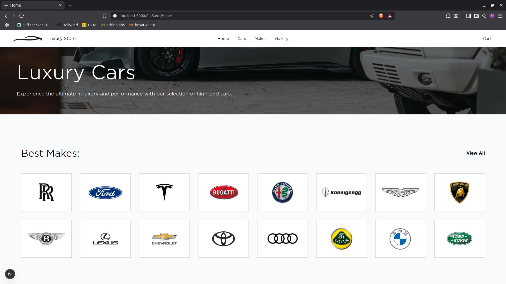
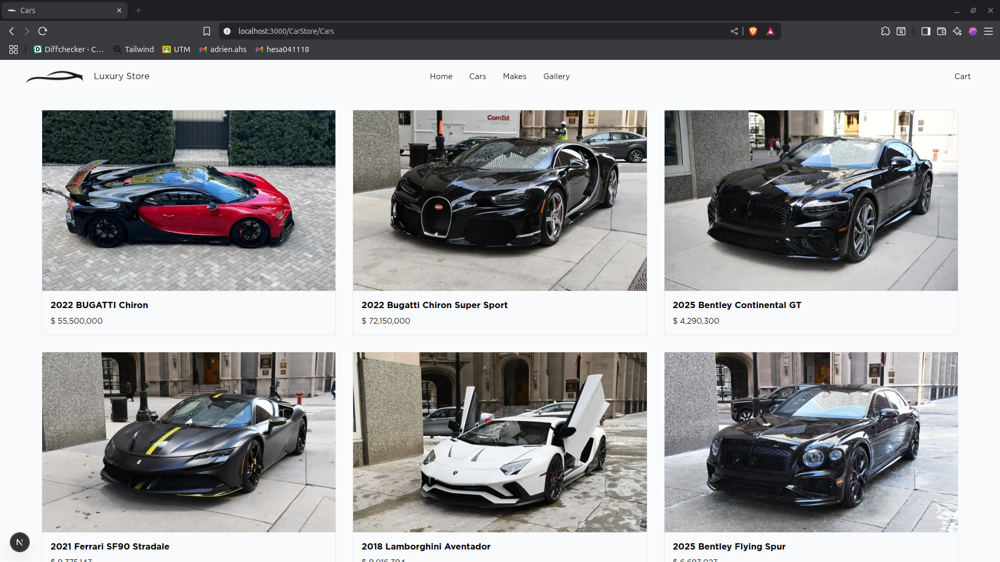
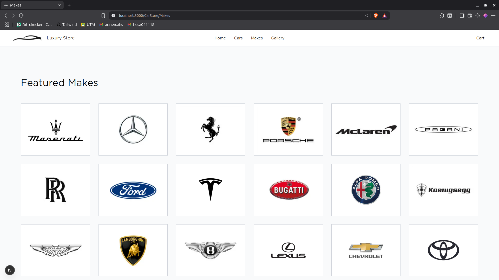
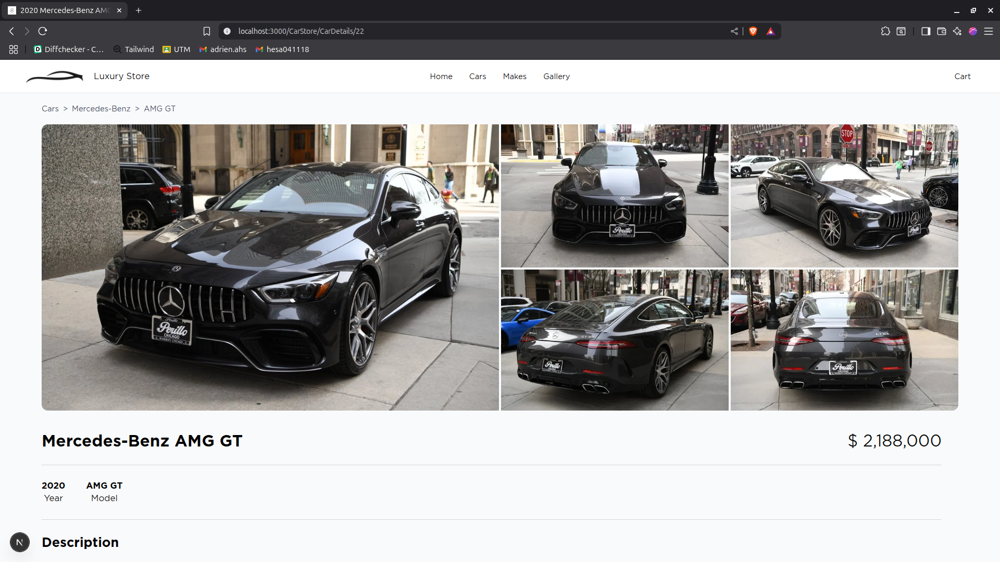
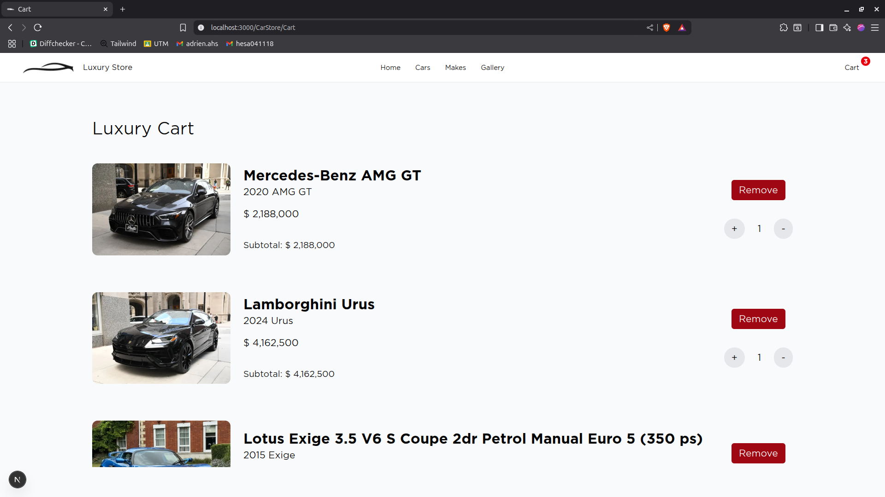
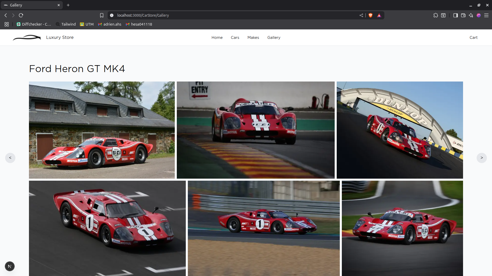

# LUXURY STORE

Proyecto realizado el `6 de mayo de 2025` utilizando principalmente NextJS, Tailwind, TypeScript, FastApi y Uvicorn. Dicho proyecto muestra la conexión a bases de datos por medio de API's.

Revisar cada carpeta `/BD-mongo`, `/EDNPOINTS` y `/cars-store` para instalar manualmente cada servicio.

Una vez instalado cada servicio manualmente, ejecutar el archivo `despierta.sh` para levantar los servicios automáticamente por medio de:

```bash
source despierta.sh
```

# DEMOSTRACIONES

Dentro de la página se pueden encontrar los siguientes apartados de manera general (Clic en la imagen para descargar el video de demostración, los videos se encuentran en la carpeta `/Public/Videos`).

Por otro lado, la demostración completa se encuentra en [clic aquí](https://drive.google.com/file/d/1f5_FcW0elGmAyJ44at4YX_nysXHRSUBo/view?usp=sharing).


### Home de Luxury Store
[](./Public/Videos/home_luxury.mp4)

### Catálogo de autos de lujo
[](./Public/Videos/catalogo-luxury.mp4)

### Marcas de autos de lujo
[](./Public/Videos/marcar_luxury.mp4)

### Agregar al carrito
[](./Public/Videos/carrito.mp4)

### Registro de pedido
[](./Public/Videos/comprando_luxury.mp4)

### Galería de autos de lujo
[](./Public/Videos/galeria-luxury.mp4)